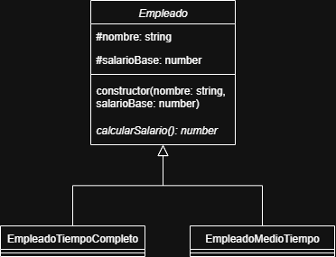
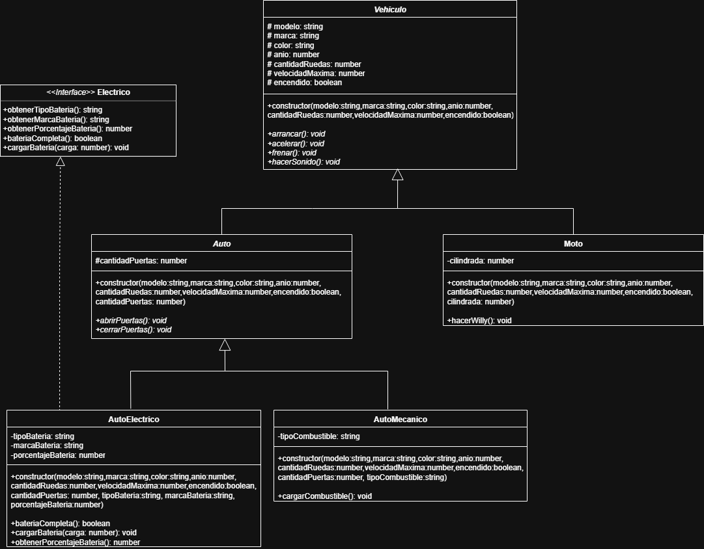

# GRUPO 14

## 👥 INTEGRANTES 
- Cordano, Nicolas
- Grgurich, Abner
- Nicaise, Raphael
- Rozas, Manuel
- Segal, Santiago

1. **Instalar las dependencias**
    ```
    npm install
    ```

    Para correr los ejercicios:
    ```
    npx ts-node ej1/ej1.ts
    npx ts-node ej2/ej2.ts
    npx ts-node ej3/ej3.ts
    npx ts-node ej4/ej4.ts
    npx ts-node ej5/ej5.ts
    ```

2. **DIAGRAMAS UML**

*Diagrama UML del punto 3*



*Diagrama UML del punto 5*


